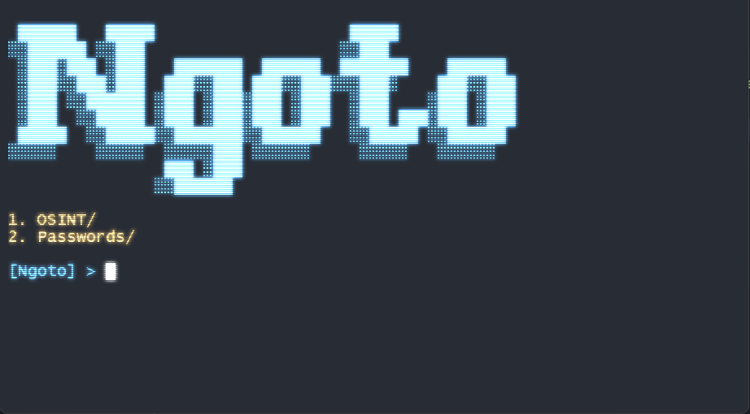

# Ngoto
[]()
[](https://codeclimate.com/github/HarryLudemann/Ngoto/maintainability)
[](https://www.codacy.com/gh/HarryLudemann/Ngoto/dashboard?utm_source=github.com&amp;utm_medium=referral&amp;utm_content=HarryLudemann/Ngoto&amp;utm_campaign=Badge_Grade)

[](https://github.com/Datalux/Osintgram/releases/tag/1.3)
[](https://github.com/loseys/Oblivion/)


# Warning :warning:

<p align="center"><b>This tool is solely for educational purposes. Developer will not be responsible for any misuse of the tool</b></p>    

# Setup:
## Using as Command line tool:
#### 1. Clone Repo:
```
git clone https://github.com/HarryLudemann/Ngoto
```

#### 2. Install Required Modules:
Move into downloaded Ngoto folder then run:
```
pip install -r requirements.txt
```
or
```
pip3 install -r requirements.txt
```

#### 4. Run
Run 'python/python3 main.py' script:
```
python main.py
```
or
```
python3 main.py
```
Which will bring you to the following:



# Example:

```python
from ngoto import plugin, command, task, Ngoto


class Basic():
    """ Basic commands for ngoto eg. exit, clear, back"""
    
    @classmethod
    @plugin(name='Tester', desc='Tester Plugin', folder='Random')
    def tester(self, logger):
        logger.info(f'Plugin ran', program='Tester')

    @classmethod
    @command(name='test', aliases=['t'], desc='Tests command')
    def test(self, pos, _, logger):
        logger.info(f'Plugin ran', program='Tester')

    @classmethod
    @task(name='TaskTest', delay=30, id='tasktest', os=['Windows'],
          desc="Tests task crfeation")
    def pc_usage(self):
        from ngoto import notify
        notify('Tester", "Testing task creation)


ngoto = Ngoto()
ngoto.load_cogs([Basic()])
ngoto.main()
```
